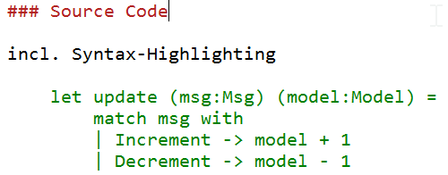

- title : Wiki for teams and companies
- description : Overview about an Azure DevOps based Wiki
- author : Marko Apfel
- theme : night
- transition : default

---

## Technical Wiki

<br/>
<br/>

### Introduction

[bit.ly/mapfel-wiki](http://bit.ly/mapfel-wiki)

<br/>
<br/>
PoC: MA

---

### Agenda

- [Why we need a technical Wiki?](#/WhyWeNeedTechnicalWiki)
- [Why we decided for a Git/Markdown-based Wiki?](#/WhyTechniciansLikeGit-basedWikis)
- [Contribution](#/contribution)

---
- id : WhyWeNeedTechnicalWiki

## Why we need a technical Wiki?

code and knowledge are our assets & **value**

→ persist & spread knowledge to increase it

</br>

- collaboratively building documentation
- creating and maintaining knowledge bases
- gathering tacit knowledge
- ...

' tacit knowledge = knowledge not related to any specific project but essential to getting things done in an organization

---


> It is your responsibility as a professional developer  
  to properly document code and software  
  that is intended for use by others.

---

## Contribution & Permissions

- public Wiki: 90-9-1 rule  
  (90: read, 9: read & edit, 1: read, edit & create)

- enterprise Wiki  
  contribution level is much higher based on the fact that  
  _people are contributing as part of the daily course of their work_  
  → **ideally: 0-0-100!!!**

---

## Wiki platforms

- specific Wiki systems  
  (Wikipedia, DokuWiki, MediaWiki, ..)

- collaboration management  
  (Confluence, SharePoint)

- Nowadays: Lightweight Git/Markdown-based Wikis  
  (github, BitBucket, **Azure Devops**, docs.microsoft.com, ..)

---
- id : WhyTechniciansLikeGit-basedWikis

### Why technicians like Git-based Wikis

- it's handy, it's fast, it's flexible

- provides all Benefits from a DVCS
  - Collaboration
  - Online & Offline-Editing
  - Branching
  - Diffing

- versioned in a context, because commit wraps
  - all belonging changes (docs, pics, references)
  - the commit message

---

- Markup-Language
  - frees you from presentation
  - all pages have the same look & feel
- Export-Options
  - [Pandoc](https://pandoc.org/) allows exporting to numberless formats
  - use cace: external documents, like manuals, guidelines, ...
- Flexibility regarding hoster
  - No vendor lock-in  
    (in seconds we can move to another hoster)
- It's fun, it's modern  
  (at least for the most)

---

### Why we use Markdown

- it's really fast to write and manage
  - limited and easy to remember formatting tags
  - perfect suited for versioning because of text
- Markdown can be a useful tool for producing clean & professional looking
  - research papers, memos
  - blog posts
  - books
- without the hassle of remembering lots of HTML tags

</br>

 <small>http://www.makeuseof.com/tag/learning-markdown-write-web-faster/</small>

→ btw: this presentation as well (Markdown and Git & FsReveal)

---

### Headers

```markdown
1 # H1
2 ## H2
3 ### H3
4 #### H4
5 ##### H5
6 ###### H6
```

# H1
## H2
### H3
#### H4
##### H5
###### H6

---

Alternatively, for H1 and H2, an underline-ish style:

```markdown
Alt-H1
======

Alt-H2
------
```

Alt-H1
======

Alt-H2
------

---

### Emphasis

```markdown
Emphasis, aka italics, with *asterisks* or _underscores_.
Strong emphasis, aka bold, with **asterisks** or __underscores__.
```

Emphasis, aka italics, with *asterisks* or _underscores_.  
Strong emphasis, aka bold, with **asterisks** or __underscores__.

---

### Lists

```markdown
1. First ordered list item
2. Another item
   * Unordered sub-list.
1. Actual numbers don't matter, just that it's a number
   1. Ordered sub-list
3. And another item.
```

1. First ordered list item
2. Another item
   - Unordered sub-list.
1. Actual numbers don't matter, just that it's a number
   1. Ordered sub-list
3. And another item.

btw: Markdown takes care, regarding numbering  
→ use 1. only

---

### References & Links

- URL-Reference  
  `[text for the link](http-address)`

- Link to another page  
  `[text for the link](<filename with ext>)`

- Images  
``  
  
tip: skip the alternate text

---

### Source Code

incl. Syntax-Highlighting

```fsharp
let update (msg:Msg) (model:Model) =
    match msg with
    | Increment -> model + 1
    | Decrement -> model - 1
```



---

### Start Editing


---

### Take care of the commit message


</br>
</br>

--- 

### Commit Messages

</br>

use `...` for trivial changes

</br>

[Guideline: Commit](https://todo)

<small>Committing Code and other artifacts to a VCS</small>

</br>
</br>

[BestPractices: Commits](https://todo)

---

### History


---

### Diffing


---

### toggle between edit and preview


---

### FAQ

- EN vs. DE?
  - Code: EN, Wiki: EN or DE  
    The more technical the more English

- Can I break something? → No!!!

---

## Perspective

* Content, content, content
	* Software Maintenance Manuals
	* Build Manuals
	* Architectural knowledge, diagrams

* Workshops
	* Git-Basics
	* offline editing

* Exporting content


---

### Links

- [Markdown Cheatsheet](https://github.com/adam-p/markdown-here/wiki/Markdown-Cheatsheet)

- [Learning Markdown: Write For the Web, Faster](http://www.makeuseof.com/tag/learning-markdown-write-web-faster/)

- [Presentation: Wiki for projects, Teams and Compananies](https://mapfel.github.io/wiki-presentations)

- [technisches Wiki of Marko (ToDo)](https://mapfel.azure.com/ToDo/_wiki)

---


