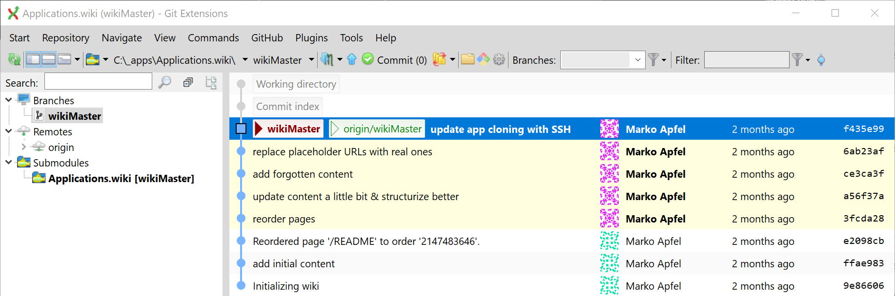
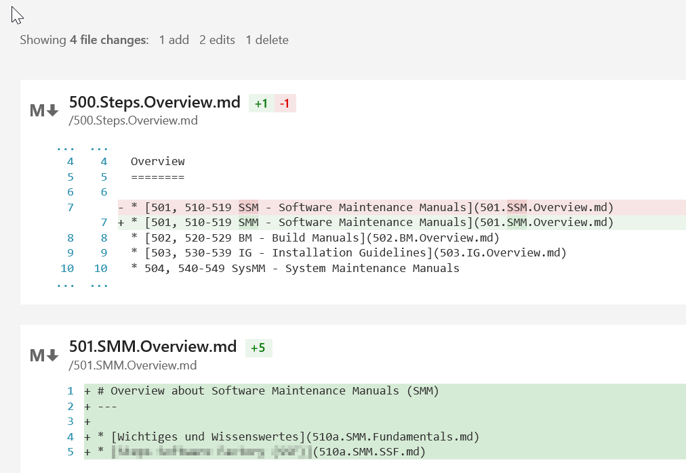
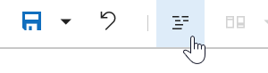

- title : Wiki der Step Ahead
- description : Überblick zum technischen Wiki der Step Ahead
- author : Marko Apfel
- theme : night
- transition : default

***

## Technical Wiki der Step Ahead

 
 

### Introduction

[bit.ly/sag-wiki](http://bit.ly/sag-wiki)

 
 
Product-Management, PoC: MA

---

### Agenda

* [Why we need a technical Wiki?](#/WhyWeNeedTechnicalWiki)
* [Why we use a Git/Markdown-based Wiki?](#/WhyTechniciansLikeGit-basedWikis)
* [Structure of our Wiki](#/StructureOfOurWiki)
* [Contribution](#/contribution)

***
- id : WhyWeNeedTechnicalWiki

## Why we need a technical Wiki?

software and knowledge are our assets & value

→ persist & spread knowledge

 

* collaboratively building documentation
* creating and maintaining knowledge bases
* gathering tacit knowledge
* ...

 
 

> It is your responsibility as a professional developer   
to properly document software  
that is intended for use by others.

' tacit knowledge = knowledge not related to any specific project but essential to getting things done in an organization

---

## Contribution & Permissions

* public Wiki  
90-9-1

* enterprise Wiki  
contribution level is much higher  
based on the fact that people are contributing 
as part of the daily course of their work  

→ **everybody full control**

*** 

## Wiki platforms

* specific Wiki systems  
(DokuWiki, MediaWiki, ..)

* collaboration management  
(Confluence, SharePoint)

* Lightweight Git/Markdown-based Wikis  
(github, BitBucket, VSTS, docs.microsoft.com, ..)

---
- id : WhyTechniciansLikeGit-basedWikis

### Why technicians like Git-based Wikis

* It's handy, it's fast, it's flexible
* All Benefits from a DVCS
	* Collaboration
	* Online & Offline-Editing
	* Branching
	* Diffing
* Versioned as a whole
	* Figure out what the status of an exported manual  
to a given point in time was
* Versioning in a context
	* Commit wraps 
		* All belonging changes 
		* Commit message
		* Relocating content together with adjusted references

---

* Markup-Language
	* Frees from presentation
	* All pages have the same look & feel
* Artifact dividing
	* text, images, ..
* Export-Options
	* Pandoc
	* External documents (UM, IG, ..)
* Flexibility regarding hoster
	* No vendor lockin
* It' s fun, it's modern

***

### Why we use Markdown

* It's fast to write
* Markdown can be a useful tool for producing clean & professional looking 
	* research papers
	* memos
	* email messages
	* blog posts
* without the hassle of remembering lots of HTML tags

 

 <small>http://www.makeuseof.com/tag/learning-markdown-write-web-faster/</small>

→ btw: this presentation as well (Git/Markdown/FsReveal)

---

### Headers

	 1 # H1
	 2 ## H2
	 3 ### H3
	 4 #### H4
	 5 ##### H5
	 6 ###### H6

# H1
## H2
### H3
#### H4
##### H5
###### H6

---

Alternatively, for H1 and H2, an underline-ish style:
	
	Alt-H1
	======
	
	Alt-H2
	------
	
Alt-H1
======

Alt-H2
------

---

### Emphasis

	Emphasis, aka italics, with *asterisks* or _underscores_.
	Strong emphasis, aka bold, with **asterisks** or __underscores__.

Emphasis, aka italics, with *asterisks* or _underscores_.  
Strong emphasis, aka bold, with **asterisks** or __underscores__.

---

### Lists

	1. First ordered list item
	2. Another item
		* Unordered sub-list. 
	1. Actual numbers don't matter, just that it's a number
		1. Ordered sub-list
	3. And another item.

1. First ordered list item
2. Another item
	* Unordered sub-list. 
1. Actual numbers don't matter, just that it's a number
	1. Ordered sub-list
3. And another item.

btw: Markdown takes care, regarding numbering  
→ use 1. only

---

### References & Links

* URL-Reference  
`[text for the link](http-address)`

* Link to another page  
`[text for the link](<filename with ext>)`

* Images  
``  
  
tip: skip the alternate text

---

### Source Code

incl. Syntax-Highlighting

    let update (msg:Msg) (model:Model) =
        match msg with
        | Increment -> model + 1
        | Decrement -> model - 1

***
- id : StructureOfOurWiki

## Structure of the Wiki

* [**Generic IT topics**](#/structure-000)
* [**Guidelines**](#/structure-200)
* [**Documentation**](#/structure-300)
* [**Specifications**](#/structure-400)
* [**Steps specific knowledge**](#/structure-500)
* Databases 
* Coding
* [**Tools**](#/structure-900)
* WFX

---
- id : structure-000

### Generic IT topics (000)

* IT systems of Step Ahead
	* Steps
	* Team Foundation Server
	* CORP.IT-Infos für neue Mitarbeiter in CORP.Produkt
	* Testsysteme der Produktentwicklung
* External services
	* Office 365
	* Visual Studio Team Services

---
- id : structure-200

### Guidelines

* Organization
* IT-Fundamentals
* Coding
* Standard Tools
* ...

---

### Organizational Guidelines & Instructions

`.../Guidelines/Organization.md`

* HR-related Guidelines
* **Activity Management, Tracking & Controlling**
	* Steps Agile
	* Committing Code

--- 

### Activity Management, Tracking & Controlling

`.../Guidelines/Organization/StepsAgile.md"`

---
- id : structure-300

### Documentation

* Essential documents for projects  
SMM, BM, SysMM, IG, UM

* Tips and tricks for Markdown and Pygments

* Writing good Installation Guidelines

* Templates

---

### SMM - Software Maintenance Manual

---
- id : structure-400

### Specification

`.../Specifications.md`

---
- id : structure-500

### Steps specific knowledge

`.../Manuals.md`

---
- id : structure-900

### Tools and Applications

`.../Tools.md`

* How to setup a new machine
* XCopy-deployable Applications
* Git

---

### Setup new machine

***
- id : contribution

## Contribution

* online  

	[Wiki Home (Readme.md)](https://stepahead.visualstudio.com/Wiki/_wiki)  

* offline  
`git clone https://stepahead.visualstudio.com/Wiki/_wiki`

---

### Start Editing

---

### Take care of the commit message

 
 

--- 

### Commit Messages

 

use `...` for trivial changes

 

[Guideline: Commit](https://stepahead.visualstudio.com/Wiki/_wiki/wikis/Wiki.wiki?pagePath=%2FGuidelines%2FOrganization%2FCommitCode)

<small>Committing Code and other artifacts to a VCS</small>

 
 

[BestPractices: Commits](https://stepahead.visualstudio.com/Wiki/_wiki/wikis/Wiki.wiki?pagePath=%2FTools%2FGit%2FBestPractices.Commits)

---

### History

---

### Diffing

---

### toggle between edit and preview

---

### FAQ

* EN vs. DE?
	* Code: EN, Wiki: EN or DE  
The more technical the more English

* Can I break something? → No!!!

***

## Perspective

* Content, content, content
	* Software Maintenance Manuals
	* Build Manuals
	* Architectural knowledge, diagrams

* Workshops
	* Git-Basics
	* offline editing

* Exporting content

---

### Links

* [Markdown Cheatsheet](https://github.com/adam-p/markdown-here/wiki/Markdown-Cheatsheet)

* [Learning Markdown: Write For the Web, Faster](http://www.makeuseof.com/tag/learning-markdown-write-web-faster/)

* [Presentation: Wiki der Step Ahead](https://stepahead.github.io/presentations/#/)

* [technisches Wiki der Step Ahead](https://stepahead.visualstudio.com/Wiki/_wiki)

***

